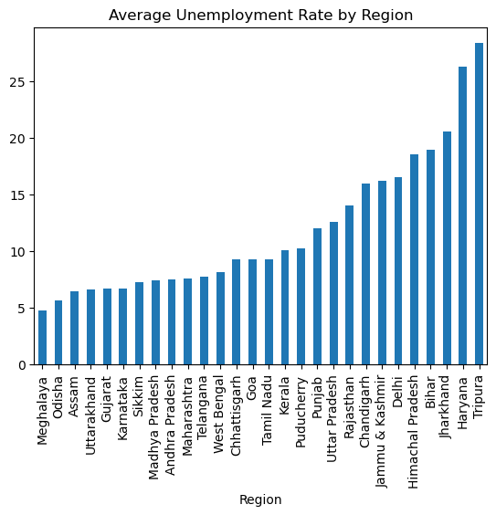

# 📊 Unemployment Analysis

## 📌 Description
This project analyzes unemployment rate during Covid-19.

## 🛠️ Technologies Used
- Python
- Pandas
- Matplotlib

## 📊 Analysis
- Time-based trend
- Region-wise comparison

## 📷 Output

## 📊 Insights   👈 YEH ADD KARNA HAI
- Unemployment increased during Covid-19.
- Some regions were more affected.
- After peak, unemployment decreased.

## 🚀 Conclusion
The project shows impact of Covid on unemployment.