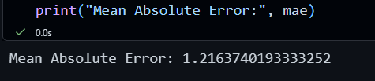

# 🚗 Car Price Prediction

## 📌 Description
This project predicts the selling price of a car based on features like year, fuel type, transmission, and kilometers driven using machine learning.

## 🛠️ Technologies Used
- Python
- Pandas
- Scikit-learn
- Matplotlib

## 🤖 Algorithm
- Linear Regression

## 📊 Result
- Model evaluated using Mean Absolute Error (MAE)
- MAE: ~1.5 (approx)

## 📷 Output

## 📊 Insights
- Car price decreases as the car gets older.
- Cars with lower kilometers driven have higher prices.
- Fuel type and transmission also impact the price.

## 🚀 Conclusion
The model can estimate car prices based on input features with reasonable accuracy and can be useful for price prediction in the automobile market.
