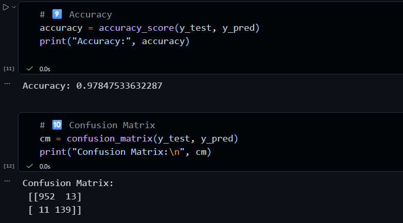

# 📧 Spam Email Detection

## 📌 Description
This project classifies emails as spam or not spam using machine learning techniques.

## 🛠️ Technologies Used
- Python
- Pandas
- Scikit-learn

## 🤖 Algorithm
- Multinomial Naive Bayes

## 📊 Result
- Accuracy: ~98%

## 📷 Output

## 📊 Insights
- Spam messages often contain repeated promotional words.
- Machine learning can effectively detect spam emails.

## 🚀 Conclusion
The model successfully classifies emails with high accuracy and can be used for spam filtering systems.
